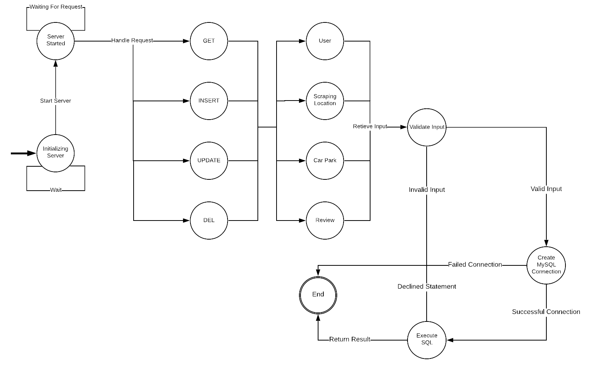

# DirectMe - Application Programming Interface (API)

The focus behind this final year computing project is to make parking easier, and dynamic for the user. The idea works by using the external data that will be displayed in our application programming interface (API) which will be combined with the user’s information that has been specified previously in the application. This information will then be inserted into an algorithm that will determine what is the best location to park their vehicle within a radius of the postcode, geo-location, or street name given.

This component...

## Editors
* Martyn Fitzgerald - 16025948

## Finite State Diagram

This is a diagram that shows how the system shall be used.

<div align="center">

</div>

<hr>

## Software Used

* Node.js
* Visual Studio Code
* Lucidchart
* Amazon Web Services (AWS)

## Setup Enviroment (Windows/Cloud Services)

1. Install Git (https://gitforwindows.org/).
2. Install Node.js 12+ LTS (https://nodejs.org/en/download/).
3. Install MySQL Workbench 8.0 CE (https://dev.mysql.com/downloads/workbench/).
4. Create a AWS account, if one does't already exist.

## Installation

1. Open Command Prompt.
2. Clone the git repository to your computer's workspace.
```bash
git clone https://gitlab.uwe.ac.uk/m4-fitzgerald/Parking-Application-API-Prototype.git
```
3. Move into the folder of the reporsitory.
```bash
cd Parking-Application-API-Prototype
```
4. Install all dependencies.
```bash
npm install
```
5. Zip all internal files within the folder Parking-Application-API-Prototype. Note: Dont just do the main folder, make sure you highlight all of the files inside! 
6. Sign into AWS Management Console. 
7. Open the 'Services' Menu and then select the service 'Elastic Beanstalk' under the sub menu of 'Compute'.

8. Select option 'Create a new environment'.

9. Afterwards it will ask what type of tier the enviroment will be, select 'Web server environment'.

10. Fill in the name of the application and under the section 'Application code'.

11. Select platform as 'Node.js'.

12. Select 'Upload your code' and choose the zip file created previously. Then Create the environment which may take a few minutes. 

13. In the new enviroment select 'Configuration'.

14. Edit the 'Software'.

15. Insert 'npm start', then apply the settings.

16. Go back to the 'Configuration' and edit the 'Database'.

17. Create a database, with all the details shown below however, create a unique password.

18. Using MySQL Workbench connect to the database just created.

19. Create a new schema called 'DirectMe'.
20. Execute the DirectMe.sql into the schema created.
21. Go to the dashboard of the 'Elastic Beanstalk', it should display the health as 'Ok' also at the top of the screen the endpoint should be visible [directmeapi-env.eba-syyipmj2.us-east-1.elasticbeanstalk.com].
